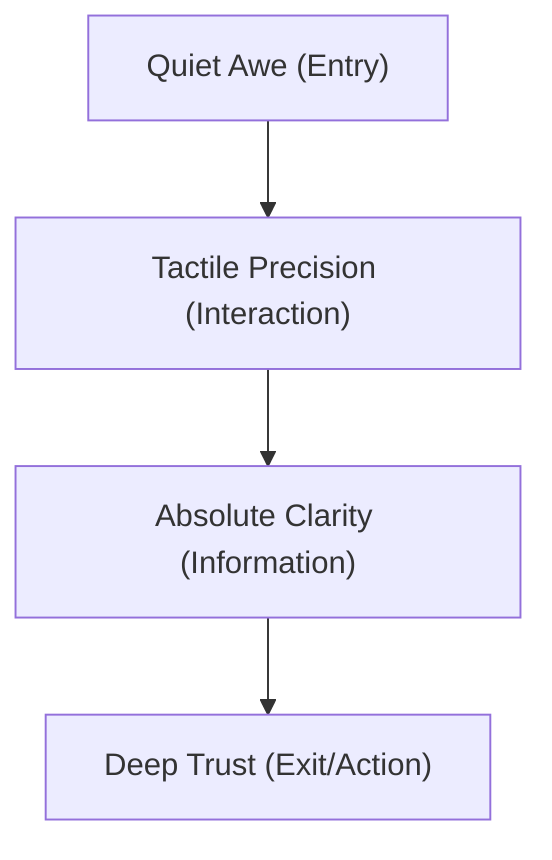

# VYOMA: THE VISUAL BIBLE
### Creative Direction & Brand Design System
**Version:** 1.0.0  
**Classification:** Internal Brand Standard  
**Tone:** Elegant, Calm, Confident, Expensive, Timeless  
**Theme:** *Apple designed NASA’s operating system.*

---

## 1. Design Philosophy: "Precisionism"

Precisionism is the intersection of mathematical rigor, scientific clarity, and understated luxury. It is the belief that complexity is not solved by decoration, but by extreme structural refinement. 

*   **Subtracted Complexity:** Every pixel, line, and border must earn its existence. If an element does not clarify, direct, or reveal, it is omitted.
*   **Scientific Honesty:** We do not decorate with "futuristic" tropes. We display real data structures, precise coordinates, and functional layouts.
*   **The Luxury of Restraint:** True premium quality whispers. It does not shout. We command attention through massive negative space, exquisite typography, and absolute alignment.
*   **Functional Light:** Light is not used as background decoration. Light is a physical force—revealing surfaces, defining edges, and drawing focus.

---

## 2. Brand Personality

The Vyoma brand exists in the tension between deep human intuition and cold machine precision.

| Dimension | Visual Expression | What it is NOT |
| :--- | :--- | :--- |
| **Intelligence** | Quiet, analytical, structured readouts. | "AI brain" graphics, glowing neural nets. |
| **Precision** | 1px clean lines, perfect alignments, mathematical grids. | Hand-drawn elements, rough alignments, organic blobs. |
| **Engineering** | Architectural drafts, schematic blueprints, vector coordinates. | Sci-fi fantasy, gaming interfaces, fake hardware controls. |
| **Trust** | Stable layouts, solid typography, structural permanence. | Volatile animations, flashing text, dark-pattern triggers. |
| **Innovation** | Unexpected layouts, microscopic interactive physics. | Standard bootstrap templates, SaaS generic cards. |
| **Premium Quality** | Custom bezier curves, obsidian depths, glass refraction. | Flat grey fills, cheap dropshadows, stock vector assets. |
| **Simplicity** | One clear focal point per viewport. | Dashboard clutter, information overload. |
| **Curiosity** | Micro-telemetry that reacts to the mouse, inviting exploration. | Passive reading, static unreactive blocks. |

---

## 3. Emotional Journey

Every interaction with Vyoma must guide the user through a curated emotional arc:



1.  **Quiet Awe (Entry):** The user enters a calm, vast, dark space. The scale feels planetary. There is a sense of weightless stability. The mind immediately slows down.
2.  **Tactile Precision (Interaction):** As the cursor moves, the interface feels physically alive. Elements respond with micro-offsets, magnetic snaps, and subtle hums of light.
3.  **Absolute Clarity (Information):** Data presents itself with mathematical efficiency. It is readable, structured, and beautiful without effort.
4.  **Deep Trust (Exit/Action):** Actions are deliberate and absolute. Confirmations feel like locking an airlock or launching a probe: satisfying, secure, and permanent.

---

## 4. Color Palette

The palette is rooted in the vacuum of space, polished metal, and cleanroom glass, punctuated by single-wavelength photon emissions.

```
Space Obsidian (Bg)      Graphite (Borders)       Helium Silver (Text)     Titanium White (Headers)  Kelvin Cyan (Accent)
[   #08080C   ]          [   #1E2026   ]          [   #8E929D   ]          [   #F8F9FA   ]          [   #00E5FF   ]
```

### The Primary Palette
*   **Space Obsidian (`#08080C`):** The absolute canvas. A deep, non-pure black with a tiny hint of indigo to avoid looking dead. It represents the endless void.
*   **Stellar Graphite (`#121318`):** The secondary surface. Used for panels, system trays, and structural regions.
*   **Helium Silver (`#8E929D`):** The secondary typography color. Muted, highly readable, calm.
*   **Titanium White (`#F8F9FA`):** The primary typographic and highlight color. Pure, sterile, bright.

### The Border & Line Palette
*   **Chamber Iron (`#1E2026`):** The default structural border. Subtle, crisp, separating space without drawing attention.
*   **Active Steel (`#323641`):** Highlight border. Used to represent focus, hover, or system activity.

### The Monochromatic Emissive Accents (Used Sparingly)
*   **Kelvin Cyan (`#00E5FF`):** Represents data streams, active lasers, and focused telemetry. Use on less than 0.5% of the total screen space.
*   **Neutron Amber (`#FFB300`):** Used strictly for warnings, critical system status, or strategic indicators.

---

## 5. Typography Direction

Typography is the architecture of language. We treat it with the rigidity of a patent filing.

*   **Primary Display Typeface:** *Outfit* or a bespoke geometric sans (e.g., *SF Pro Display*). Highly geometric, perfectly balanced circular shapes.
*   **Telemetry & Data Typeface:** *SF Mono* or *JetBrains Mono*. Used for numbers, coordinates, labels, and micro-copy. Represents scientific accuracy.
*   **Scale and hierarchy rules:**
    *   **Display Title (Hero):** 64px to 96px, light weight (`300`), tracking `-0.02em`.
    *   **Section Headers:** 32px, regular weight (`400`), tracking `-0.01em`.
    *   **Sub-sections:** 18px, semi-bold weight (`500`), tracking `0em`.
    *   **Body Copy:** 15px, regular weight (`400`), line height `1.625` (Golden Ratio adjacent), color Helium Silver (`#8E929D`).
    *   **Telemetry/Labels:** 10px, uppercase, monospace, tracking `0.15em`, color Helium Silver or Kelvin Cyan.

---

## 6. Grid System

The grid is absolute. It is the mathematical framework that enforces visual truth.

*   **The Baseline Grid:** 8px micro-grid. All paddings, margins, line heights, and heights must be multiples of 8 (or 4 for micro-spacing).
*   **The Master Column Grid:** A rigid 12-column layout.
    *   *Gutter:* 32px (strict).
    *   *Columns:* Width scales dynamically, but always bounded by margins.
    *   *Side Margins:* Desktop minimum of 64px, scaling up to 128px for ultra-wide displays to preserve negative space.
*   **Telemetry Grids:** 4-column micro-grids contained inside panels. Used to show data arrays, parameters, and small metrics.
*   **Grid Lines:** Visual structural lines (1px width, `#1E2026` opacity) are allowed to bleed into the background to emphasize the engineering aesthetic, similar to graph paper or blueprints.

---

## 7. Spacing System

Spacing defines the speed at which a user consumes information. Large spaces decelerate the eye, creating a premium, calm reading cadence.

| Token | Size | Application |
| :--- | :--- | :--- |
| `sp-micro` | 4px | Internal spacing of buttons (icon to text), status dots. |
| `sp-xsmall` | 8px | Label to input, title to subtitle grouping. |
| `sp-small` | 16px | Internal padding of small elements, button padding. |
| `sp-medium` | 24px | Small component gaps, card inner padding. |
| `sp-large` | 32px | Grid gutters, structural unit margins. |
| `sp-xlarge` | 48px | Gap between related text blocks and control elements. |
| `sp-huge` | 64px | Vertical section separation, large outer panel margins. |
| `sp-cosmic` | 128px | Hero negative space pads, major page boundaries. |

---

## 8. Corner Radius

To capture the "Apple meets NASA" feel, corner radii are tightly constrained. We use curved corners for modular containers, but keep them sharp and surgical for interactive inputs and technical modules.

*   **Outer Interface Panels:** 16px (squircle / continuous curvature if possible). Feels premium and ergonomic.
*   **Standard Cards/Modules:** 12px.
*   **Interactive Controls (Buttons, Inputs, Selectors):** 4px. A tight corner that feels precise, engineered, and intentional, rather than soft and consumer-like.
*   **Micro-indicators (Tags, Status badges):** 2px or completely sharp (0px).
*   **Telemetry Displays:** 0px. Data screens and diagnostic modules are strictly rectangular to evoke high-end instrumentation panels.

---

## 9. Shadows

In Space, light does not scatter easily. Shadows are either sharp and dramatic or soft and ambient. We completely avoid heavy, muddy grey dropshadows.

*   **The Ambient Occlusion Drop Shadow:** A multi-layered shadow simulating proximity to the background.
    *   *Layer 1:* `0 1px 2px rgba(0, 0, 0, 0.5)`
    *   *Layer 2:* `0 8px 16px rgba(0, 0, 0, 0.4)`
    *   *Layer 3:* `0 24px 64px rgba(0, 0, 0, 0.3)`
*   **The Light Leak Border (Alternative to shadow):** Instead of a shadow, elements are elevated using a 1px border gradient that catches light from the top-left corner.
    *   *Border Gradient:* `linear-gradient(135deg, rgba(255,255,255,0.1) 0%, rgba(255,255,255,0.02) 50%, rgba(255,255,255,0) 100%)`

---

## 10. Glass Material: "Stellar Silica"

We use glass to represent transparency, layers, and sophistication. It acts as an optical filter.

*   **Glass Composition:**
    *   *Background Blur:* `backdrop-filter: blur(40px)`
    *   *Background Fill:* `rgba(8, 8, 12, 0.6)` (Using Space Obsidian with 60% opacity to let background textures bleed through slightly).
    *   *Top Highlight:* An inner stroke of `1px solid rgba(255, 255, 255, 0.08)` to simulate the chamfered edge of a glass pane catching ambient illumination.
*   **Usage Rule:** Glass sheets can only overlay on top of dark empty spaces. Never stack more than two layers of glass.

---

## 11. Background System

The background is a living space, not a static gradient. It has depth, texture, and astronomical scale.

*   **The Deep Void:** A gradient base of `#050507` at the bottom to `#0B0C10` at the top.
*   **The Micro-Noise Layer:** A subtle, low-opacity (2%-3%) digital grain texture. This replicates the visual texture of physical film grain, eliminating digital flatness.
*   **The Orthogonal Grid:** An ultra-faint layout grid lines system, visible only on high-contrast screens (color: `rgba(255,255,255,0.015)`).
*   **Nebula Dust (Atmosphere):** Extremely large, faint radial gradients of deep indigo (`rgba(20, 24, 45, 0.15)`) and dark teal (`rgba(10, 35, 35, 0.1)`) that shift slowly based on scroll or time.

---

## 12. Lighting Style

We use lighting to sculpt the UI. It represents the sun hitting spacecraft metal.

*   **The Ambient Directional Source:** Imagine a single soft white light source positioned infinitely far away at the top-left (`315°`). All highlights, borders, and shadows align to this light vector.
*   **Interactive Spotlights:** The cursor emits a faint, localized radial gradient of white light (radius: 300px, maximum opacity: 5%). As the cursor moves over borders, it temporarily illuminates them, revealing details.
*   **Luminescent Signals:** Interactive buttons contain a tiny 1px glowing line at the top edge that illuminates when hovered, mimicking optical fibers lighting up.

---

## 13. Particle Style: "Quantum Noise"

Particles are never decorative "bubbles" or "stars." They are data coordinates, telemetry points, or atoms.

*   **Shape:** Strictly 1x1 pixels or perfect circles of maximum 2px diameter. Never blurred.
*   **Color:** Pure Titanium White (`#F8F9FA`) or Kelvin Cyan (`#00E5FF`) with variable opacities (from 0.1 to 0.6).
*   **Behavior:** Non-random. They move on linear vectors, snap to grid lines, or orbit invisible gravitational centers with high momentum and low friction. They respond to scroll acceleration, condensing when scrolling fast and expanding when stationary.

---

## 14. Motion Principles

Animations do not decorate; they demonstrate the flow of logic.

*   **Physics over Timing:** We use friction-heavy, high-inertia springs. Never use linear loops or sudden bouncy movements.
*   **The Signature Ease:** For CSS transitions, use:
    ```css
    transition-timing-function: cubic-bezier(0.16, 1, 0.3, 1); /* Ease Out Quint */
    ```
*   **Speed Limits:**
    *   *Micro-interactions (button hover, coordinate shift):* 200ms - 300ms.
    *   *Panel entries, route transitions:* 600ms - 800ms (slow, cinematic reveal).
    *   *Telemetry updates (numbers changing):* Fast, stepping sequences (50ms increments) to feel like real computational readouts.

---

## 15. Scroll Philosophy: "Cinematic Unfold"

Scroll is a narrative journey through a three-dimensional chamber.

*   **Continuous Inertial Scrolling:** Implementing a gentle scroll damping to make the viewport feel massive and heavy, like moving a physical camera on a crane.
*   **Parallax Depth:** Background grid lines move at 10% scroll speed, telemetry panels move at 100%, and atmospheric light blobs move at 20%. This creates immediate spatial depth.
*   **Triggered Assembly:** As sections enter the viewport, they do not just fade in. They assemble themselves. Borders grow from their intersection points, text typography shifts up by 8px, and coordinate metrics tick up from zero.

---

## 16. Hover Philosophy: "Magnetic Attraction"

Hovering should feel tactile and high-fidelity, like adjusting dials on a luxury amplifier.

*   **Magnetic Cursor Snapping:** When the cursor approaches an interactive icon or small button (within 30px), the cursor is magnetically pulled towards the center of the element, and the element shifts 3-5px to meet it.
*   **Optical Boundary Illumination:** The borders of the button change from Chamber Iron (`#1E2026`) to Active Steel (`#323641`). A subtle white glow sweep passes along the border line.
*   **Text/Numeric Readout shift:** When hovering, micro-coordinates (e.g., `[ 45.92 // 01 ]`) appear next to the button text, confirming that the system is ready to execute.

---

## 17. Icon Style: "Monoline Instruments"

Icons are functional technical indicators. They are treated like architectural symbols.

```
       [+] Precise Intersection Lines
        |
    +---+---+  <-- 1.5px Stroke Width
    |   |   |
    |  (o)  |  <-- Perfect Geometric Centers
    |   |   |
    +---+---+
```

*   **Stroke Weight:** Strict 1.5px stroke width. No variance.
*   **Geometry:** Perfectly centered on a 24x24px grid. Composed of raw circles, squares, 45-degree diagonals, and straight horizontals.
*   **Styling:** Unfilled outlines only. Icons never contain solid color fills unless in a highly critical warning state (e.g., hazard badge).
*   **End Caps:** Rounded strokes (`stroke-linecap: round`) to soften the coldness of pure geometric vectors.

---

## 18. Illustration Style: "Vector Blueprints"

We do not use standard cartoon or flat vectors. Our illustrations are functional schematics.

*   **Isometric Orthographic Projections:** Complex systems (e.g., database pipelines, cloud architectures) are rendered as wireframe isometric outlines.
*   **Callouts & Dimensions:** Lines extend from components to display mock dimensions, labels, and mathematical angles (e.g., `R=12.4`, `theta=45°`).
*   **Material Rendering:** Use wireframe meshes and semi-transparent planes. It must look like CAD (Computer-Aided Design) software or an engineering patent draft.

---

## 19. 3D Object Style: "Mathematical Solids"

When 3D is used, it should resemble physics simulations or raw obsidian models.

*   **Surface Finish:** Matte obsidian, sandblasted aluminum, or high-refraction frosted glass. No colorful plastics or high-gloss cartoon reflections.
*   **Lighting:** The object is lit by the system's singular light source, casting ray-traced shadows onto its own surfaces.
*   **Form:** Perfect geometric solids (platonic solids, gyroids, mathematical waves) that morph slowly as if under physical stress or magnetic forces.
*   **Frame Rates:** Interactive 3D must run at a locked 60fps. If performance drops, it must fallback gracefully to static, high-resolution wireframe vector renders.

---

## 20. Image Direction: "The Observer"

Photography should feel like high-art documentary journalism. It is authentic, quiet, and monumental.

*   **Subject Matter:** Minimalist industrial architecture, cleanrooms, optical lenses reflecting laser beams, natural landscapes showing geometric patterns (e.g., volcanic basalt columns, wind-swept sand ridges).
*   **Color Profile:** High contrast, extremely low saturation. Deep, rich blacks with sharp, bright highlights. Muted midtones.
*   **Composition:** Central symmetry or aggressive rule-of-thirds. A single human figure in a vast architectural space to emphasize scale and humility.
*   **Post-processing:** Added fine-grain sensor noise. No bright color grading, no warm golden hour hues. We prefer cold, clinical daylight or monochromatic light.

---

## 21. Texture Language

Textures add tactile weight to a screen, separating the premium from the generic.

*   **Brushed Titanium:** Subtle vertical or horizontal directional brushing on buttons and dividers.
*   **Frosted Glass (Silica):** Heavy diffraction that diffuses the content underneath into soft light waves.
*   **Raw Paper/Cement Noise:** A microscopic organic grain applied to background layers to give them a tactile, physically printed quality.
*   **Polished Dark Marble:** Extremely subtle, dark veins running through primary panel backgrounds, reflecting light only at steep angles.

---

## 22. Animation Principles: "Conservation of Energy"

We adhere to physical laws. Elements do not appear out of nothingness; they expand, rotate, or slide in accordance with mass and gravity.

*   **Sequencing (Staggering):** Elements load in sequence from top-left to bottom-right.
    *   *Delay:* 40ms stagger between adjacent list items.
*   **Clipping Mask Reveals:** Headers and large numbers reveal themselves by sliding out from behind an invisible clipping mask (a "reveal line"), simulating physical sliders moving into place.
*   **Numerical Telemetry Tick:** Numeric values do not jump. They count up rapidly using random digits before locking onto the final correct number.

---

## 23. UI Density: "The Cockpit Contrast"

We combine empty space with hyper-dense data regions to create visual interest and functional credibility.

*   **The Expanse:** Large structural sections (e.g., introducing a division of the company) use massive whitespace, a single short sentence, and a single focal point.
*   **The Detail Cluster:** Surrounding this expanse are small, hyper-dense telemetry displays. These contain fine text, tiny numbers, and line separators. This mimics looking at a high-end luxury watch face: a clean, elegant dial surrounded by microscopic mechanical complexity.

---

## 24. Accessibility

Premium design is inclusive design. We do not sacrifice readability for aesthetics.

*   **Contrast Ratios:** Text must maintain a minimum contrast ratio of 4.5:1 against the dark background. Body text uses `#8E929D` which guarantees compliance.
*   **Surgical Focus Indicators:** Tab navigation uses a precise 1px focus ring offset by 2px from the element, colored in Kelvin Cyan (`#00E5FF`) to guide keyboard users cleanly.
*   **Motion Reduction:** Respect the user's OS preference:
    ```css
    @media (prefers-reduced-motion: reduce) {
      * {
        animation-duration: 0.01ms !important;
        animation-iteration-count: 1 !important;
        transition-duration: 0.01ms !important;
        scroll-behavior: auto !important;
      }
    }
    ```

---

## 25. Component Philosophy: "Encapsulated Instruments"

Every component is treated as a physical instrument (like a flight deck altimeter or a laboratory oscilloscope).

*   **Visual Self-Containment:** Every module has distinct, clean border boundaries. There are no loose, floating chunks of text.
*   **Telemetry Frame:** Components are framed with subtle corner markers (`[ ]` brackets or crosshairs at the corners) to anchor them to the page coordinate system.
*   **Status Indicators:** Every component has a small status indicator in its top-right corner (e.g., `[ ONLINE ]` or a slowly pulsing 2px green dot) to show it is active and integrated.

---

## 26. CTA (Call To Action) Philosophy: "The Confirmation Lock"

CTAs are critical decisions. They should feel like confirming an orbital launch.

*   **Understated Styling:** We do not use loud, solid-colored buttons.
*   **The Design:** A thin 1px border button with a dark background.
*   **The Hover Transformation:** When hovered, the button fills from left-to-right with a clean gradient of white or subtle cyan light. The arrow icon inside shifts slightly to the right (`+4px`) and snaps back.
*   **The Sound/Feedback:** (For interactive prototype) A subtle micro-haptic or visual screen shake (0.5px) upon activation, giving physical satisfaction to the click.

---

## 27. Visual Hierarchy: "The Scale Gap"

We create hierarchy through extreme scale contrasts rather than heavy font weights or bright colors.

```
+-------------------------------------------------------------+
| [ 01 // CORE SYSTEM ]                         10px Mono     |
|                                                             |
| VYOMA                                         96px Light    |
|                                                             |
| We engineer intelligent systems.              15px Sans     |
|                                                             |
+-------------------------------------------------------------+
```

*   **Size Contrast:** We pair massive display type (96px) immediately with microscopic label type (10px). This creates an immediate dramatic tension that feels modern and architectural.
*   **Weight Contrast:** Never pair regular and bold. We pair light (`300`) with semi-bold (`500`).
*   **Color Contrast:** Only the critical focus keyword is highlighted in Titanium White; surrounding context is dropped to Helium Silver.

---

## 28. White Space Rules: "The Breath"

White space is not "empty" space; it is a positive design element that holds the visual weight of the page.

*   **The 60-30-10 Air Rule:**
    *   **60% Void:** Pure negative space, revealing background texture/noise.
    *   **30% Structure:** Text content, borders, layouts, and lines.
    *   **10% Interactive Density:** Micro-details, active telemetry, CTAs, cursors.
*   **Padding Integrity:** Content inside panels must never come within 32px of the panel borders. Panels must never come within 64px of each other.

---

## 29. Premium Details: "The Micro-Craft"

The details are what make the design feel "expensive." These are subtle additions that reward close inspection.

*   **Interactive Crosshairs:** A very faint, 1px horizontal and vertical coordinate axis line follows the user's cursor across the screen, snapping to structural lines and components as it passes them.
*   **Micro-Coordinates:** Every section contains its pixel coordinate relative to the document body, rendered in 9px monospace text (e.g., `LOC: [1420 // 0840]`), updating live as the window resizes.
*   **Border Intersection Dots:** Wherever 1px grid lines intersect, a tiny 2x2px solid white dot marks the intersection, referencing draftsmanship blueprints.
*   **Telemetric Loading Triggers:** On page load, numbers and parameters cycle rapidly through hexadecimal sequences before resolving, giving a sense of computational processing.

---

## 30. Things NEVER to use

To maintain the integrity of the Vyoma brand, the following elements are strictly forbidden:

1.  **NEVER** use rounded buttons with a radius greater than 4px.
2.  **NEVER** use playful, organic, hand-drawn vector illustrations or doodles.
3.  **NEVER** use emojis in copy, titles, buttons, or logs.
4.  **NEVER** use generic stock photos of people pointing at screens or smiling in offices.
5.  **NEVER** use typical "AI brain," "robot hand," or "digital glowing finger" graphics.
6.  **NEVER** use bright, colorful gradient backgrounds (e.g., pink-to-purple, orange-to-yellow).
7.  **NEVER** use bouncing, cartoonish, or elastic spring animations.
8.  **NEVER** use heavy, blurred, dark drop shadows that bleed into backgrounds.
9.  **NEVER** use standard UI cards with thick borders and flat grey fills.
10. **NEVER** use generic font pairings like Times New Roman, Open Sans, or Comic Sans.
11. **NEVER** use neon cyberpunk colors (hot pinks, lime greens) for styling layout blocks.
12. **NEVER** use flashy scroll-hijacking that completely overrides native scroll velocity.
13. **NEVER** use large, solid-color filled callout blocks (e.g., solid blue alert boxes).
14. **NEVER** use gamified elements (badges, level ups, gamified progression bars).
15. **NEVER** use icons that are filled, multicolored, or 3D-glossy.
16. **NEVER** use generic visual placeholders. All assets must be custom-generated or curated.
17. **NEVER** let text scale without a bounding grid, causing line lengths to exceed 75 characters.
18. **NEVER** use diagonal layouts or jagged angles. Everything is built on a 90-degree orthogonal grid.

---
*Developed by Vyoma Creative Direction Board.*  
*Design Bible Approved for immediate platform development.*
